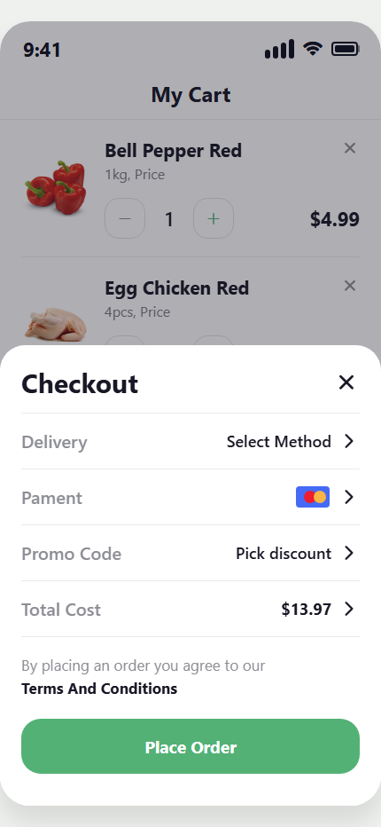
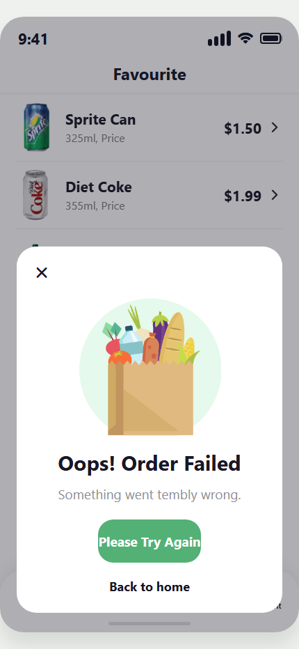

11/ 4 / 2026
Grocery App - React Native (Expo)
Thông tin sinh viên
Họ tên: Vu Tien manh
MSSV: 23810310375
Mô tả ứng dụng

#Ứng dụng mô phỏng một hệ thống mua sắm thực phẩm (grocery app) được xây dựng bằng React Native + Expo.

 Chức năng chính:
 Đăng nhập người dùng
Lưu thông tin bằng AsyncStorage
 Quản lý giỏ hàng (Cart)
Thêm / xoá / tăng giảm số lượng sản phẩm
Tự động lưu giỏ hàng
 Yêu thích sản phẩm
 Tìm kiếm & lọc sản phẩm
 Đặt hàng
Lưu lịch sử đơn hàng
 Trang tài khoản
Hiển thị thông tin user
Hiển thị danh sách đơn hàng
Đăng xuất
 Công nghệ sử dụng
React Native (Expo)
AsyncStorage
React Hooks (useState, useEffect)
Local Storage (Web)
#Hướng dẫn chạy ứng dụng
1. Clone repo
git clone 
cd your-repo
2. Cài dependencies
npm install
3. Chạy ứng dụng
npx expo start
4. Mở app
Quét QR bằng Expo Go (Android/iOS)
Hoặc chạy trên web:
w
 Ảnh demo

##  Demo Video
Video mô tả các chức năng chính của ứng dụng:

 [Xem video tại đây](https://drive.google.com/file/d/1KUMUGkaIpPEQ_zrd5VZpSNbWBD53bo7v/view?usp=sharing)

#tra loi cau hoi 
AsyncStorage là một cơ chế lưu trữ dữ liệu dạng key–value trên thiết bị (local storage) trong React Native, cho phép ứng dụng lưu dữ liệu dưới dạng chuỗi JSON và truy xuất lại khi cần. Nó hoạt động bất đồng bộ (asynchronous), nghĩa là việc đọc/ghi dữ liệu không làm block UI, giúp app vẫn mượt khi xử lý dữ liệu nền. So với việc chỉ dùng state, AsyncStorage có ưu điểm là dữ liệu vẫn được giữ lại ngay cả khi tắt app hoặc reload, trong khi state chỉ tồn tại tạm thời trong runtime và sẽ mất khi ứng dụng khởi động lại. Tuy nhiên, AsyncStorage không thay thế hoàn toàn state mà thường được dùng kết hợp (state để hiển thị, AsyncStorage để lưu lâu dài). So với Context API, AsyncStorage dùng để lưu trữ dữ liệu bền vững (persistent storage), còn Context API dùng để chia sẻ state giữa nhiều component trong cùng một phiên chạy. Context không lưu được dữ liệu sau khi reload, còn AsyncStorage thì có thể, vì vậy hai công nghệ này phục vụ mục đích khác nhau nhưng thường được kết hợp trong ứng dụng thực tế.

# Nectar App 10/4

Họ và tên: Vũ Tiến Mạnh
MSSV: 23810310375

## Screens da hoan thanh

- Checkout
- Order accepted
- Error
- Account

## Screenshot ket qua

### Checkout

### Order accepted

### Error

### Account

